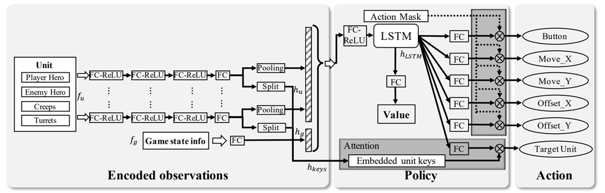
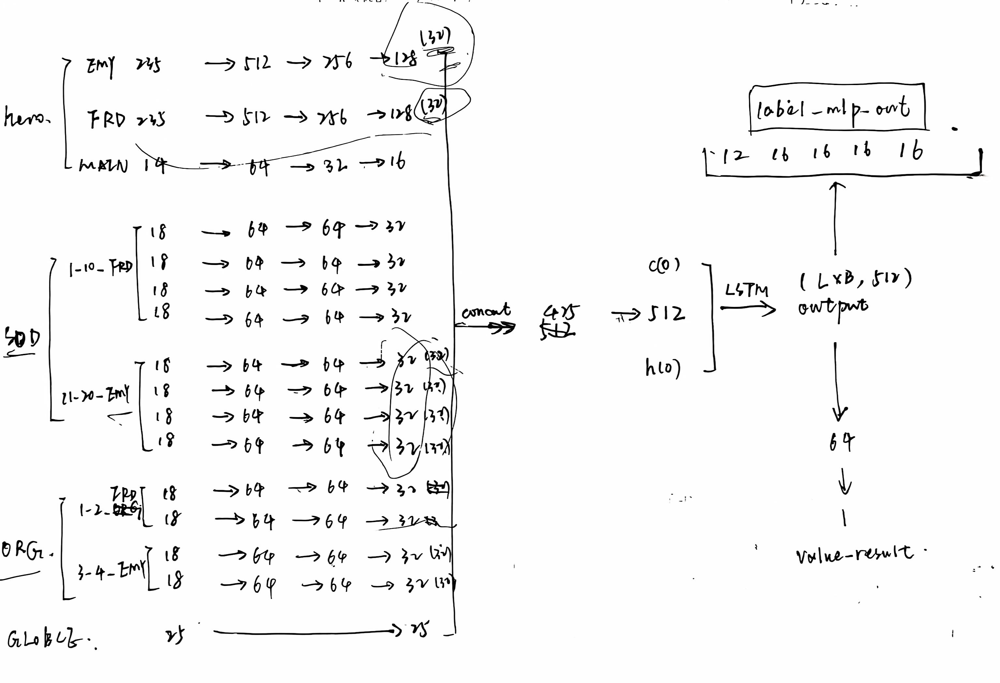
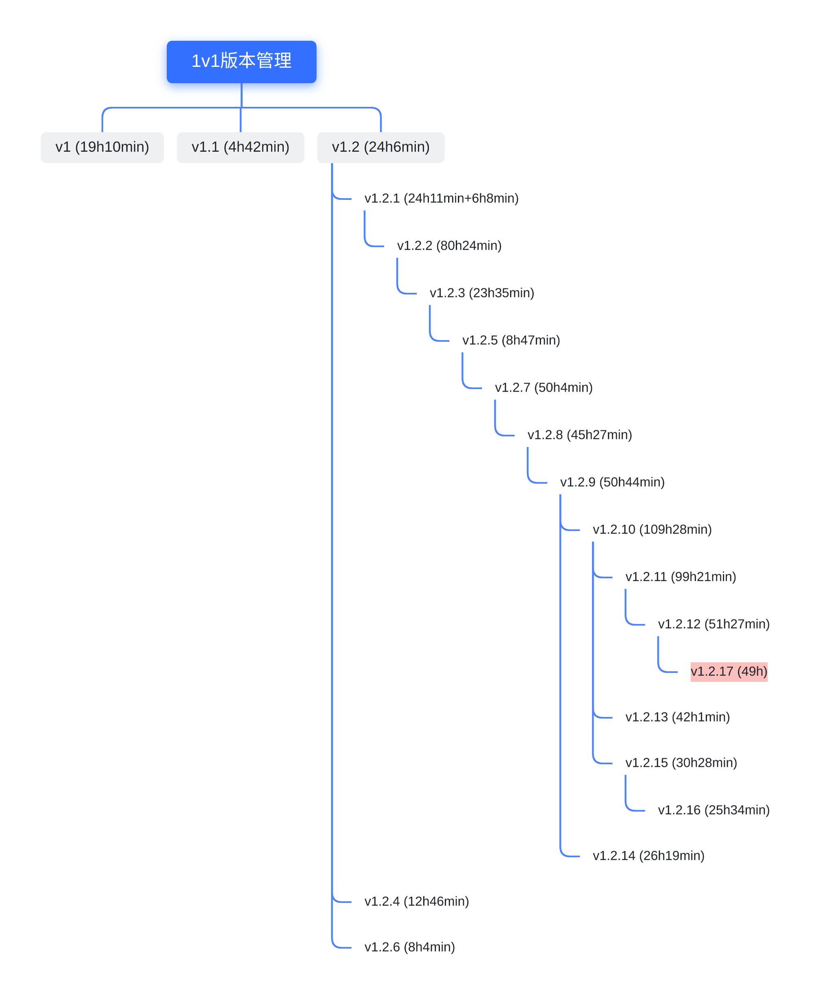
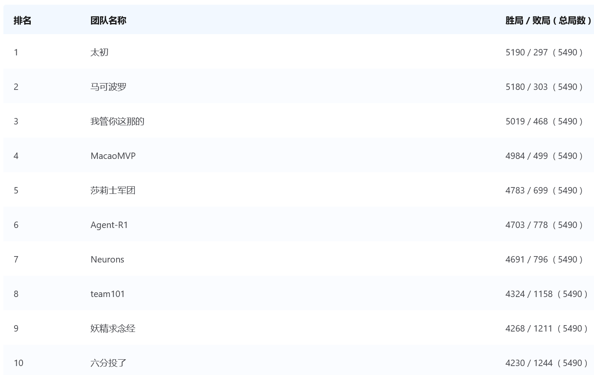

# 介绍
20250815开始比赛, 赛程总共35天, 比去年少了10天, 还是比较难的

今年官方将除了算法以外的内容全部删减了, 包括obs, reward, network, 但是我去年自己手搓的对state_dict解包的info完全可以用上, 也就是自己做的obs能直接用, 因此非常容易修改, 仅用半天完成全部修改开始训练

# v1 20250817 (剩余33天)
## 状态设计
相比去年删除了公孙离的特殊信息, 将buff和mark改为这三个新英雄后羿、李元芳、虞姬的, 关于buff和mark的调试方法请见下文的调试信息
### 单位个体 (英雄、小兵、防御塔、河蟹)
基础离散信息标准如下 (默认向下取整):
| 名称 | 离散点大小 | 最大范围 | 离散范围 | 注释 |
| - | - | - | - | - |
| 相对位置(视野中) | 600 | 25200(+600)x25200(+600) | 43x43 | 视野内为41x41, 最后左右各加两维作为视野外 |
| 小地图位置(全局) | 5000 | 9e4x9e4 | 18x18 | |
| hp (生命值) | 100 | 0~2400(+100) | (26,) | [0, 2400]为0~24, 以上均为25 (向上取整) |
| ep (法力值) | 30 | 0~210(+30) | (9,) | [0,240)为0~7, 以上均为8 |
| cd (技能冷却) | 1 | 0~10(+1) | (13,) | [0,10]为0~10, 以上均为11, 没学技能或看不到对方技能cd时为12 (向上取整) |
| 金币获得 (单帧增长量) | 20 | 0~300(+20) | (17,) | [0,300)为0~14, 以上均为15, 当0<增长量<20时为16 (每秒自动+4~6钱) |

一个单位的通用信息包含 (防御塔, 河蟹, 小兵, 英雄都具有这些信息) 总维度 `43*2+1+18*2+2+27+15=167`:
| 名称 | 维度 | 注释 |
| - | - | - |
| 相对位置 | (43,)*2 | 参考上文 |
| 相对距离 | (1,) | 相对于当前英雄的距离, 距离除以12000, 限制在(0,1)内 |
| 全局位置 | (18,)*2 | 参考上文 |
| 全局局部xz比例 | (2,) | 在全局位置划分的5000x5000中, 目标所在的xz比例, 范围(-1,1) |
| 血量 | (now/max, 离散hp(26,))=(27,) | 离散hp参考上文 |
| 印记buff | (+3+5+2+1,) | 后羿,李元芳印记或其他(15,) |

以下为英雄专属维度 `1+9+10+14*5+15+18+1+1+1+54=180`, 总维度 `180+167=347`

| 名称 | 维度 | 注释 |
| - | - | - |
| 类型 | (1,) | (-1,0,1)分别表示3种英雄: 后羿,李元芳,虞姬 |
| 专属行为 | (9,) | 当状态属于`'State_Dead', 'State_Idle', 'Direction_Move', 'Normal_Attack', 'State_Revive', 'UseSkill_1', 'UseSkill_2', 'UseSkill_3'`中时为0~7, 其余状态为8 |
| 法力 | (now/max, 离散ep(9,))=(10,) | 离散ep参考上文 |
| 一技能cd | (now/max, 离散cd(13,))=(14,) | 离散cd参考上文 |
| 二技能cd | (now/max, 离散cd(13,))=(14,) | 离散cd参考上文 |
| 三技能cd | (now/max, 离散cd(13,))=(14,) | 离散cd参考上文 |
| 闪现cd | (now/max, 离散cd(13,))=(14,) | 离散cd参考上文 |
| 回复cd | (now/max, 离散cd(13,))=(14,) | 离散cd参考上文 |
| 等级 | (15,) | 将等级1~15进行离散 |
| 金币获得 | 离散金币(18,) | 两帧间的金币变换量, 离散金币参考上文, 和当前金币总量/10000的比例 |
| 是否在草丛 | (1,) | 0/1:不在/在 |
| 是否在塔攻击范围内 | (1,) | 0/1:不在/在 |
| 是否为塔的攻击目标 | (1,) | 0/1:不是/是 |
| buff | (54,) | 包含通用buff, 三种英雄特有buff, 其他未知buff |

以下为小兵专属维度 `3+3+1+1=8`, 总维度 `8+167=175`
| 名称 | 维度 | 注释 |
| - | - | - |
| 专属行为 | (3,) | 当状态属于`'State_Dead', 'Attack_Path'`中时为0~1, 其余状态为2 |
| 类型 | (3,) | 3种小兵: 0,1,2:近战,远程,炮车 |
| 是否在防御塔攻击范围内 | (1,) | 0/1:不在/在 |
| 是否为防御塔的攻击目标 | (1,) | 0/1: 不是/是 |

以下为河蟹专属维度 `5`, 总维度 `5+167=172`
| 名称 | 维度 | 注释 |
| - | - | - |
| 专属行为 | (5,) | 当状态属于`'State_Dead', 'State_Auto', 'State_Revive, 'State_Born'`时为0~3, 否则为4 |

以下为防御塔专属维度 `3+1=4` (由于防御塔只有一个行为`'Attack_Move'`因此不需要专属行为), 总维度 `5+167=172`
| 名称 | 维度 | 注释 |
| - | - | - |
| 攻击目标 | (3,) | 无/英雄/小兵 (通过有无攻击目标, 可以判断是否正在攻击) |
| 是否有血包 | (1,) | 0/1:无/有 |
| 血包生成剩余时间 | (1,) | 距离下一次生成时间/75秒血包生成时间(2250帧) |

单位个体总状态: 2x英雄(敌我)+8x小兵(距离从近到远)+河蟹+2x防御塔(敌我),
总计目标状态数目`2*347+8*175+172+2*172=2610`

### 飞行物个体
最大包含10个敌方飞行物, 其中前面9维均为英雄子弹, 最后1个为防御塔子弹, 当飞行物数目超过1个或9个, 再按照距离从近到远排序, 维度 `5+43*2+1+18*2+2=130`

| 名称 | 维度 | 注释 |
| - | - | - |
| 来源技能 | (5,) | 0,1,2,3: 普攻,1,2,3技能,其他 |
| 相对位置 | (43,)*2 | 参考上文 |
| 相对距离 | (1,) | 相对于当前英雄的距离, 距离除以12000, 限制在(0,1)内 |
| 全局位置 | (18,)*2 | 参考上文 |
| 全局局部xz比例 | (2,) | 在全局位置划分的5000x5000中, 目标所在的xz比例, 范围(-1,1) |

飞行物总状态: `10*130=1300`

综上, 总状态维度: 单位个体总状态+飞行物个体总状态=`2610+1300=3910` (去年总状态维度`3947`)

## 网络设计
直接参考去年的两张图, 模型参考论文[Mastering complex control in moba games with deep reinforcement learning](https://aaai.org/ojs/index.php/AAAI/article/view/6144)，只不过我们没有的图像输入部分，因此不包含CNN结构。
|  |  |
|-|-|
|<div align='center'>官方模型图</div>|<div align='center'>详细模型特征维度图 (初始版本, 修改内容如下)</div>|

上面的手绘图中修改了:

1. 所有的位置信息都共享同一个网络`[Args.DIM_DISTANCE, 128, 64]`进行编码
2. 所有的Unit信息, 只要是单位(除了子弹)就有这个基础信息, 都共享同一个网络`[Args.DIM_UNIT - Args.DIM_DISTANCE, 64, 32]`进行编码
3. 删除了原来中global的特征, 拼接特征: 双方英雄, 双方士兵, 河蟹, 双方防御塔, 双方子弹特征, 总共480维
4. 在拼接完成后, 既要通过LSTM编码为512, 也通过`[480, 1024, 512]`的MLP编码, 最后再将二者拼接通过Linear`[512+512, 512]`合并特征降维到512
5. 输出保留三输出头的设计, 分别对三个英雄创建对应的预测网络: 前5个动作预测的5个`label_mlp`, 对攻击target选择的query和value网络`target_embed_mlp`, `lstm_tar_embed_mlp`, 以及对价值函数估计的`value_mlp`

P.S. 使用去年最后的网络设计, 删除mish, twohot, simnorm, layernorm所有不确定的tricks, 保留multi_head对三个智能体对应三个输出头, 修复去年的obs数据重排的问题, 去年obs第一维度不是(-1, 0, 1)而是错误的用onehot来判断所属的智能体了

## 奖励设计
保持和去年一致, 上下两帧做差奖励：
1. 换血奖励：按照`(now_hp/all_hp)**(1/4)`计算出比例（这不就是想在血量高的时候换血，血少了珍惜血量），做差
2. 塔血奖励：归一化做差
3. 金币奖励：做差
4. 法力值奖励：归一化做差
5. 死亡：每次触发一次
6. 击杀：每次触发一次
7. 经验：没到15级之前，做差；到达15级后，关闭
8. 补刀：完成小兵补刀，次数

这几个的奖励由于有不同的量纲，所以他们要乘上不同的系数（以下是默认系数配置）：
```
"hp_point": 2.0,
"tower_hp_point": 5.0,
"money": 0.006,
"exp": 0.006,
"ep_rate": 0.75,
"death": -1.0,
"kill": -0.6,
"last_hit": 0.5,
"forward": 0.01,
```

## 调试信息
由于有去年的经验, 今年完全不用对很多细节进行调试, 只调试出了今年的buff和mark信息, 也是用的去年的`debug_actor`今年改名为[`debug_agent`](./code/agent_ppo/debug/debug_agent.py)直接顺次释放一次技能, 记录下所有的buff和mark, 具体如下 (详细内容请见[`unpack_state_dict.py`](./code/agent_ppo/feature/unpack_state_dict.py)开头注释部分):

今年则没有对每个技能详细进行调整, 而是将所有找到的buff构造onehot加入到特征中, 和去年类似, 但更完整

```bash
通用buff_skills (7,)
90015: 可能是泉水的回复buff
10000: 点回复技能时候产生的buff (1.2s先消失)
10010: 回复技能产生的恢复buff (5.8s)
11001: 可能是加速buff
11002: 可能是减速buff
11010: 可能是净化buff (狄仁杰2技能)
11111: 可能某种通用buff (虞姬)
一些未知buff (6,):
911220, 911290, 914110, 914210, 914211, 914250

英雄的buff编号规律:
    前三位是英雄的id, 169, 173, 174分别为后羿, 李元芳, 虞姬
    第四位如果是0~3则表示被动,1,2,3技能的buff

后羿 (buff_skills)
buff_skills (10,):
169000, 169010, 169020, 169040,
169100,
169900, 169901, 169910, 169920, 169963,
buff_marks及其对应层数 (2,)
16900 (3层), 16901 (2层)

李元芳相关: 
buff_skills (20,):
173000, 173040,
173101, 173110, 173120, 173150, 173151, 173152, 173153, 173154, 173155, 173159, 173160, 173170, 173173,
173250,
173920, 173950, 173990, 173999,
buff_marks (2,):
17300 (4层), 17310 (1层)

虞姬相关:
buff_skills (10,)
174000, 174010, 174090,
174100,
174250, 174260,
174360,
174910, 174920, 174950,
buff_marks (0,)
```

训练19h对common_ai胜率还是不能稳定100%, 可能多输出头确实存在问题

## v1.1 20250818 (剩余32天)
加入监控信息 (还未开始启动训练, 等v1训练24h以上后启动)
1. diy_1~diy_4: 训练中camp0每个episode结束的reward_sum, hp_point, kill, last_hit (周期1min)
2. diy_5: 验证中agent每个episode结束的hp_point
3. 修改模型为MultiModel (文件名还是model.py), 即一个模型中包含三个智能体的SingleModel, 总共大小50Mb
4. 修改`eval_interval: 10 -> 32`
5. 加入eval_opponent_types配置, 但是由于修改了model结构因此不支持v1的测试了

训练4h对common_ai的胜率只有80%不到, 训练速度太慢, 多网络训练确实存在大问题, 因为并不是所有特征都无法共用 (敌方英雄信息就是共用的), 一个模型应该是有做多种技能决策的功能的, 退回一个模型, 无数出头

## v1.2 20250818 (剩余32天)
退回最初的无输出头, 单个模型的版本, 无需对obs_list进行重排, 模型修改为三英雄共用模型总共参数2.9M, 模型推理速度提升

## v1.2.1 20250819 (剩余31天)
最后v1.2 39953模型胜率更低是因为所有英雄开局都有不同时长的在泉水等待的问题, 李元芳最严重, 增加money和exp尝试解决此问题 (但是39953能打赢31428), 31428打baseline1胜率85.56%, 39953打baseline1胜率78.89%

调整: money: 6e-3 -> 8e-3, exp: 6e-3 -> 8e-3

## 后续版本管理及日志
见[飞书 - kaiwu2025/hok_semi](https://ecnhf41t16x1.feishu.cn/drive/folder/HijTf2hzMl31qbd8TS0co6xhnng?from=from_copylink)(需权限)

## 总结 20250920 (提交后一天)

本次比赛相比去年提升很多，虽然赛程更短，但是模型训练时间长了一倍，最终版模型训练时长542h步数899413(sleep 2.0)，一共四次周赛，前两周第二，后两周第一，所以**一定要在完赛前至少达到这个训练步数/时长**

模型最终使用的奖励参数就是论文[Mastering Complex Control in MOBA Games with Deep Reinforcement Learning](https://ojs.aaai.org/index.php/AAAI/article/view/6144)中的奖励，只不过将money, exp除以2了，kill也稍微变小了点。

有效改进：
1. 不使用DreamerV3的tricks，论文[Reward Scale Robustness for Proximal Policy Optimization via DreamerV3 Tricks](http://arxiv.org/abs/2310.17805)中已经进行过详细比较，说明twohot, symlog, layernorm对PPO提升基本上都是负提升
2. 不使用分英雄的输出头，或者分英雄的模型，基本没有提升，且训练/验证速度很慢

有待改进：
1. 最终模型训练到542h后基本没有提升，可能是没有调过奖励的原因，离散奖励kill应该继续提高，而hp连续奖励应该降低（tower_hp不好说是离散还是连续，感觉更像是离散奖励）
2. 参考本次有力竞争对手的模型，在打赢对面后会尽可能去吃对方血包，可以通过奖励引导加入吃对方血包离散奖励，例如cake_enemy=1
3. 参考去年以及师兄的经验，对每l类励设置一个对应的value输出头能有提升，例如将输出分为4类：
    - 血量相关: hp_point, death, kill
    - 推塔: tower_hp_point
    - 经济: money, exp, last_hit
    - 本体状态: ep_rate
4. **重要**: 小兵的target索引顺序是按照runtime id升序排列，而我构造的obs中小兵索引按照距离排列，需要也修改为runtime id排列 (未修改)
5. **重要**: 敌我血包计算逻辑错误, 在计算血包归属前进行了坐标翻转, 导致红方阵营视角下的血包都是反的 (已修改)

最终排名第一，虽然没有打赢第二名(36/52)
